# Лабораторная работа "Развертывание GPU-кластера Kubernetes"

**Задачи лабораторной работы:**
* развернуть одновузловой учебный GPU-кластер Kubernetes на виртуальной машине с NVIDIA GPU;
* установить NVIDIA GPU Operator;
* подключить мониторинг GPU и проверить запуск CUDA/PyTorch-нагрузки в нескольких режимах выделения GPU.

**В рамках выполнения работы вы должны продемонстрировать навыки:**
* готовить Linux-узел к установке Kubernetes;
* устанавливать Kubernetes через kubeadm;
* разворачивать NVIDIA GPU Operator;
* проверять доступность GPU внутри pod;
* включать мониторинг GPU через DCGM Exporter, Prometheus и Grafana;
* запускать PyTorch workload в режимах exclusive, time-slicing и MPS;
* анализировать результаты по логам workload и метрикам Grafana.
---
Подключаемся к серверу
```Bash
ssh -i ~/.ssh/id_ed25519 alex_bondarenko2003@51.250.20.172
```
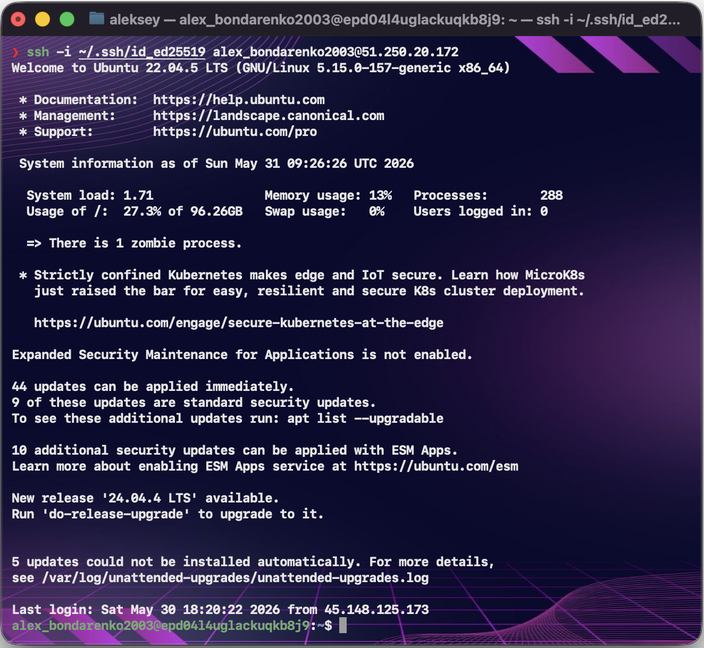

Проверил доступные директории
```Bash
ls -la
ls -la manifests
```
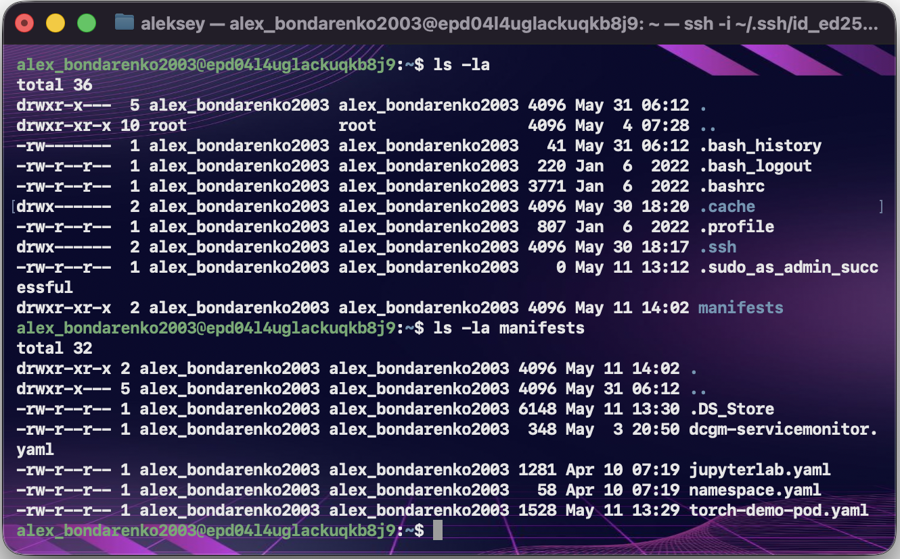

#### Подготовка операционной системы (настройка ядра и отключение swap)

Отключаем swap
```Bash
sudo swapoff -a 
sudo sed -ri '/\sswap\s/s/^#?/#/' /etc/fstab
```
Настраиваем загрузку модулей ядра
```Bash
cat <<'EOF' | sudo tee /etc/modules-load.d/k8s.conf 
overlay 
br_netfilter 
EOF

sudo modprobe overlay 
sudo modprobe br_netfilter
```
Настраиваем параметры `sysctl`
```Bash
cat <<'EOF' | sudo tee /etc/sysctl.d/k8s.conf 
net.bridge.bridge-nf-call-iptables = 1 
net.bridge.bridge-nf-call-ip6tables = 1 
net.ipv4.ip_forward = 1 
EOF 

sudo sysctl --system
```
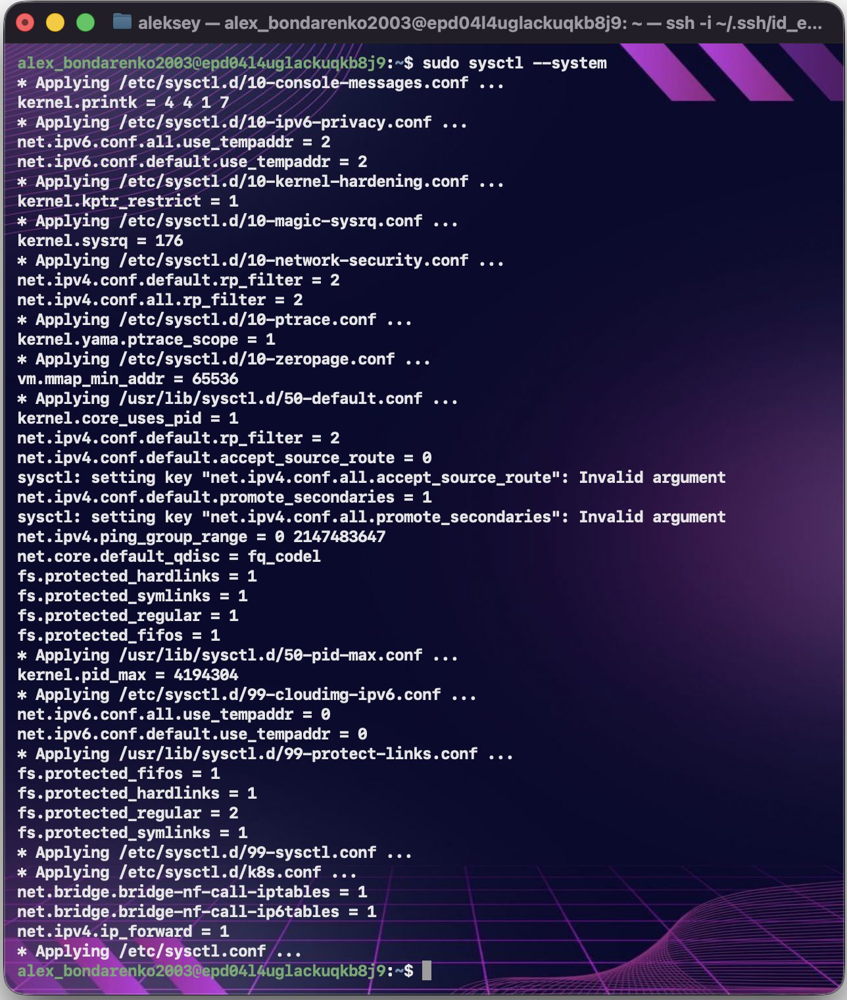

#### Установка Kubernetes 1.34

Добавляем официальный репозиторий и устанавливаем компоненты K8s:
```Bash
sudo mkdir -p /etc/apt/keyrings
```
Скачиваем ключ репозитория
```Bash
curl -fsSL https://pkgs.k8s.io/core:/stable:/v1.34/deb/Release.key | \ 
sudo gpg --dearmor -o /etc/apt/keyrings/kubernetes-apt-keyring.gpg
```
Добавляем репозиторий
```Bash
echo 'deb [signed-by=/etc/apt/keyrings/kubernetes-apt-keyring.gpg] https://pkgs.k8s.io/core:/stable:/v1.34/deb/ /' | \ 
sudo tee /etc/apt/sources.list.d/kubernetes.list
```
Устанавливаем kubelet, kubeadm и kubectl
```Bash
sudo apt-get update 
sudo apt-get install -y kubelet kubeadm kubectl 
sudo apt-mark hold kubelet kubeadm kubectl
```
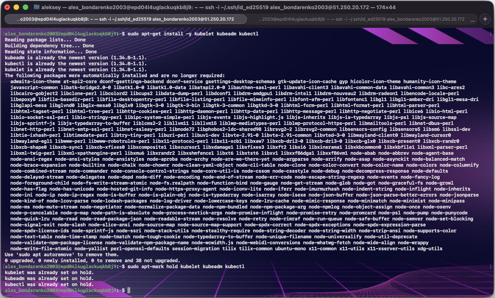

#### Инициализация кластера и настройка сети

Запускаем создание кластера (используем стандартную подсеть для плагина Flannel)
```Bash
sudo kubeadm init --pod-network-cidr=10.244.0.0/16
```
Настройка конфига kubectl
```Bash
mkdir -p "$HOME/.kube" 
sudo cp -i /etc/kubernetes/admin.conf "$HOME/.kube/config" 
sudo chown "$(id -u):$(id -g)" "$HOME/.kube/config"
```
Разрешаем запуск pod'ов на control-plane (так как у нас одна нода)
```Bash
kubectl taint nodes --all node-role.kubernetes.io/control-plane- || true
```
Установка сетевого плагина Flannel
```Bash
kubectl apply -f https://github.com/flannel-io/flannel/releases/latest/download/kube-flannel.yml
```
**Проверка**
```Bash
kubectl get nodes -o wide
kubectl get pods -A
```
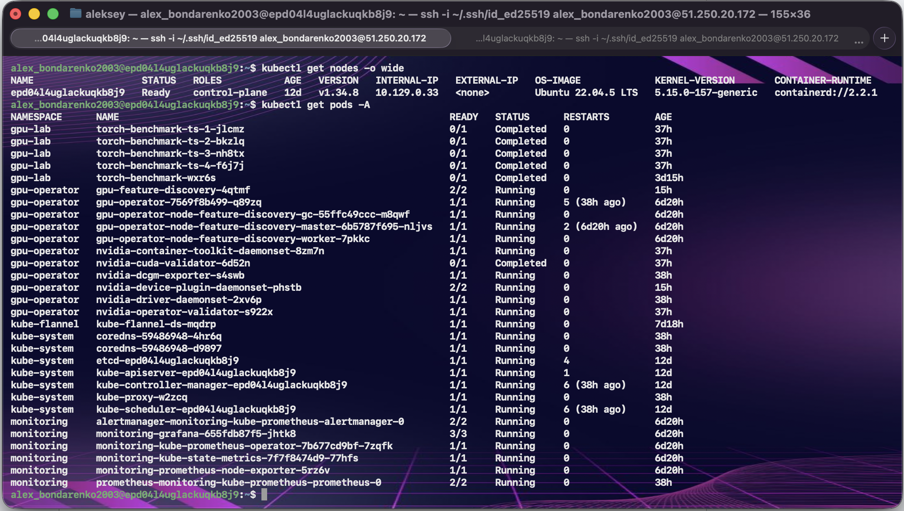
(Ранее всё уже было установлено и запущено коллегами)

#### Установка Helm (пакетный менеджер для Kubernetes)

Для установки операторов нам нужен Helm
```Bash
curl -fsSL -o get_helm.sh https://raw.githubusercontent.com/helm/helm/main/scripts/get-helm-3 chmod 700 get_helm.sh ./get_helm.sh
```
Проверка версии, чтобы убедиться, что всё прошло успешно
```Bash
helm version
```
Вывод: `version.BuildInfo{Version:"v3.20.2", GitCommit:"8fb76d6ab555577e98e23b7500009537a471feee", GitTreeState:"clean", GoVersion:"go1.25.9"}`

#### Установка NVIDIA GPU Operator

Создание namespace с нужными правами
```Bash
kubectl create namespace gpu-operator
kubectl label --overwrite namespace gpu-operator pod-security.kubernetes.io/enforce=privileged
```

Применение конфига для режимов разделения GPU (Time-slicing/MPS)
```Bash
kubectl apply -f gpu-lab/device-plugin-sharing-config.yaml
```

Установка самого оператора через Helm
```Bash
helm repo add nvidia https://helm.ngc.nvidia.com/nvidia
helm repo update

helm install gpu-operator nvidia/gpu-operator \
  -n gpu-operator \
  --version=v25.10.1 \
  --set driver.enabled=true \
  --set driver.version=580.105.08 \
  --set toolkit.enabled=true \
  --set dcgmExporter.enabled=true \
  --set devicePlugin.config.name=device-plugin-config \
  --set devicePlugin.config.default=default
```

После запуска нужно дождаться, пока все поды поднимутся
```Bash
kubectl get pods -n gpu-operator -w
```

#### Установка стека мониторинга (Prometheus + Grafana)

Установка стека Prometheus
```Bash
helm repo add prometheus-community https://prometheus-community.github.io/helm-charts
helm repo update

kubectl create namespace monitoring

helm install monitoring prometheus-community/kube-prometheus-stack \
  -n monitoring
```

Проверка, что поды мониторинга запустились
```Bash
kubectl get pods -n monitoring
```
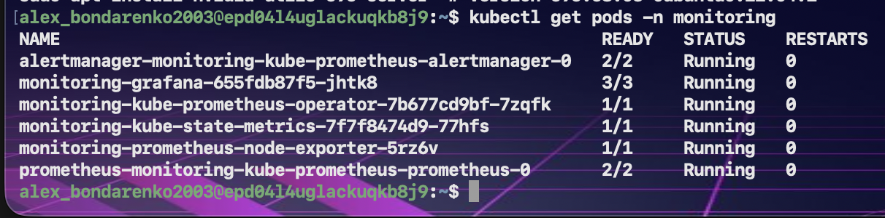

Интеграция DCGM Exporter с Prometheus
```Bash
kubectl label svc -n gpu-operator nvidia-dcgm-exporter monitor=dcgm --overwrite
kubectl apply -f manifests/dcgm-servicemonitor.yaml
kubectl get servicemonitor -n gpu-operator
```

Доступ к Grafana
```Bash
kubectl port-forward -n monitoring svc/monitoring-grafana 3000:80
kubectl get secret -n monitoring monitoring-grafana \
  -o jsonpath='{.data.admin-password}' | base64 -d && echo
```

#### Получение данных для отчета (проверка GPU)

```Bash
kubectl exec -n gpu-operator ds/nvidia-driver-daemonset -- nvidia-smi
```
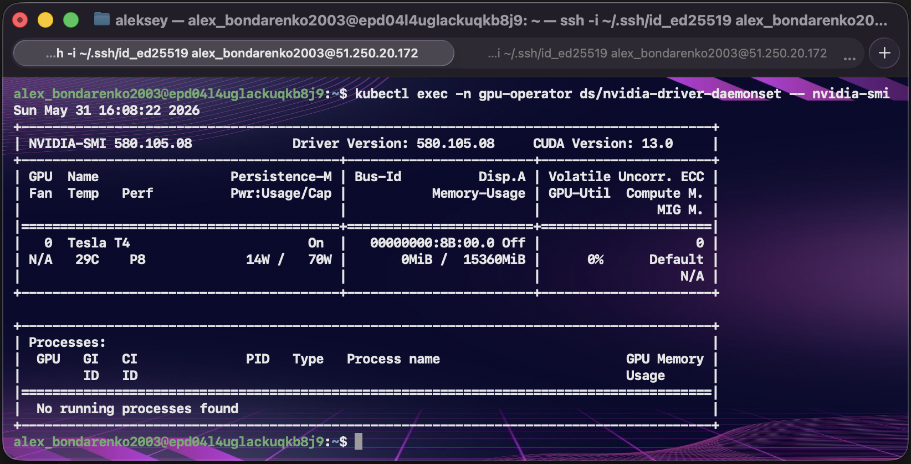

#### Очистка старых задач

Удалим завершенные джобы в неймспейсе `gpu-lab`, чтобы они нам не мешали
```Bash
kubectl delete jobs -n gpu-lab --all
```
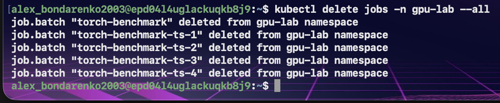

#### Создаем манифест с тяжелым бенчмарком

```Bash
cat << 'EOF' > manifests/torch-benchmark-exclusive.yaml
apiVersion: batch/v1
kind: Job
metadata:
  name: torch-benchmark
  namespace: gpu-lab
spec:
  template:
    spec:
      restartPolicy: Never
      containers:
      - name: benchmark
        image: pytorch/pytorch:2.2.1-cuda12.1-cudnn8-runtime
        resources:
          limits:
            nvidia.com/gpu: 1
        command:
        - "python"
        - "-c"
        - |
          import torch
          import time
          
          if not torch.cuda.is_available():
              print("Ошибка: CUDA недоступна!")
              exit(1)
              
          device = torch.device('cuda:0')
          print(f"--- Информация о GPU ---")
          print(f"имя GPU: {torch.cuda.get_device_name(0)}")
          print(f"объем GPU memory: {torch.cuda.get_device_properties(0).total_memory / 1e9:.2f} GB\n")
          
          # Создаем огромные тензоры (каждый займет ~1.6 ГБ видеопамяти)
          N = 20000
          print(f"Генерация матриц {N}x{N}...")
          A = torch.randn(N, N, device=device)
          B = torch.randn(N, N, device=device)
          
          steps = 30
          times = []
          
          print("Прогрев GPU (Warmup)...")
          for _ in range(3):
              _ = torch.matmul(A, B)
          torch.cuda.synchronize()
          
          print("\nЗапуск бенчмарка (длительность ~1-2 минуты)...")
          for i in range(steps):
              start = time.time()
              
              # Внутренний цикл для удержания 100% утилизации GPU в течение шага
              for _ in range(10):
                  _ = torch.matmul(A, B)
              torch.cuda.synchronize()
              
              end = time.time()
              step_time = end - start
              times.append(step_time)
              print(f"Шаг {i+1:02d}/{steps} выполнен за {step_time:.4f} сек")
          
          print("\n--- Итоговые результаты для отчета ---")
          print(f"avg_step_sec: {sum(times)/len(times):.4f}")
          print(f"min_step_sec: {min(times):.4f}")
          print(f"max_step_sec: {max(times):.4f}")
          print(f"peak_cuda_mem_gb: {torch.cuda.max_memory_allocated(device)/1e9:.4f}")
EOF
```

#### Эксперимент 1: exclusive GPU

В этом режиме pod получает физическую видеокарту целиком

Сбрасываем настройки device-plugin на дефолтные и перезапускаем его
```Bash
NODE="$(kubectl get nodes -o jsonpath='{.items[0].metadata.name}')"
kubectl label node "$NODE" nvidia.com/device-plugin.config- || true
kubectl rollout restart -n gpu-operator daemonset/nvidia-device-plugin-daemonset
```

Убеждаемся, что Kubernetes видит 1 целый GPU
```Bash
kubectl describe node "$NODE" | sed -n '/Capacity:/,/Allocatable:/p'
```
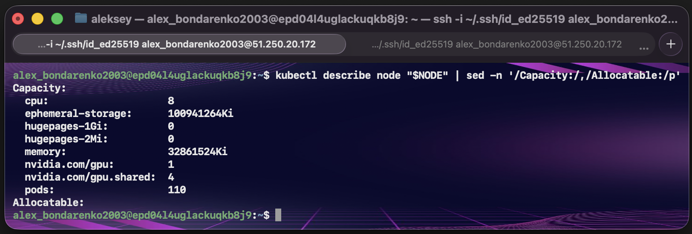

#### Очистка старых задач и запуск новой

Удалим завершенные джобы в неймспейсе `gpu-lab`, чтобы они нам не мешали
```Bash
kubectl delete jobs -n gpu-lab --all
```


```Bash
kubectl apply -f manifests/torch-benchmark-exclusive.yaml
```
Вывод: `job.batch/torch-benchmark created`

Запуск процесса
```Bash
kubectl logs -n gpu-lab -f job/torch-benchmark
```

Вывод в консоли
```Bash
--- Информация о GPU ---
имя GPU: Tesla T4
объем GPU memory: 15.64 GB

Генерация матриц 20000x20000...
Прогрев GPU (Warmup)...

Запуск бенчмарка (длительность ~1-2 минуты)...
Шаг 01/30 выполнен за 35.0729 сек
Шаг 02/30 выполнен за 36.4327 сек
Шаг 03/30 выполнен за 39.6140 сек
Шаг 04/30 выполнен за 38.8123 сек
Шаг 05/30 выполнен за 38.9977 сек
Шаг 06/30 выполнен за 38.9504 сек
Шаг 07/30 выполнен за 39.9995 сек
Шаг 08/30 выполнен за 40.9199 сек
Шаг 09/30 выполнен за 39.3317 сек
Шаг 10/30 выполнен за 40.2225 сек
Шаг 11/30 выполнен за 40.5603 сек
Шаг 12/30 выполнен за 39.9106 сек
Шаг 13/30 выполнен за 41.0232 сек
Шаг 14/30 выполнен за 40.3218 сек
Шаг 15/30 выполнен за 40.5084 сек
Шаг 16/30 выполнен за 41.7264 сек
Шаг 17/30 выполнен за 39.6687 сек
Шаг 18/30 выполнен за 39.3903 сек
Шаг 19/30 выполнен за 41.7483 сек
Шаг 20/30 выполнен за 40.8624 сек
Шаг 21/30 выполнен за 39.6969 сек
Шаг 22/30 выполнен за 40.5142 сек
Шаг 23/30 выполнен за 38.9937 сек
Шаг 24/30 выполнен за 40.7982 сек
Шаг 25/30 выполнен за 39.6312 сек
Шаг 26/30 выполнен за 41.0767 сек
Шаг 27/30 выполнен за 40.9816 сек
Шаг 28/30 выполнен за 42.0481 сек
Шаг 29/30 выполнен за 41.2036 сек
Шаг 30/30 выполнен за 40.1563 сек

--- Итоговые результаты для отчета ---
avg_step_sec: 39.9725
min_step_sec: 35.0729
max_step_sec: 42.0481
Генерация матриц 20000x20000...
Прогрев GPU (Warmup)...

Запуск бенчмарка (длительность ~1-2 минуты)...
Шаг 01/30 выполнен за 39.6182 сек
Шаг 02/30 выполнен за 40.9872 сек
Шаг 03/30 выполнен за 40.6063 сек
Шаг 04/30 выполнен за 41.6250 сек
Шаг 05/30 выполнен за 41.4108 сек
Шаг 06/30 выполнен за 39.3923 сек
Шаг 07/30 выполнен за 39.8063 сек
Шаг 08/30 выполнен за 42.1568 сек
Шаг 09/30 выполнен за 41.7098 сек
Шаг 10/30 выполнен за 41.2472 сек
Шаг 11/30 выполнен за 41.2168 сек
Шаг 12/30 выполнен за 41.2447 сек
Шаг 13/30 выполнен за 39.8794 сек
Шаг 14/30 выполнен за 40.3440 сек
Шаг 15/30 выполнен за 41.0487 сек
Шаг 16/30 выполнен за 39.8326 сек
Шаг 17/30 выполнен за 39.6537 сек
Шаг 18/30 выполнен за 39.1529 сек
Шаг 19/30 выполнен за 38.8145 сек
Шаг 20/30 выполнен за 39.6409 сек
Шаг 21/30 выполнен за 39.5231 сек
Шаг 22/30 выполнен за 41.1412 сек
Шаг 23/30 выполнен за 40.9044 сек
Шаг 24/30 выполнен за 40.5406 сек
Шаг 25/30 выполнен за 42.2211 сек
Шаг 26/30 выполнен за 39.1836 сек
Шаг 27/30 выполнен за 39.7373 сек
Шаг 28/30 выполнен за 40.9578 сек
Шаг 29/30 выполнен за 39.8007 сек
Шаг 30/30 выполнен за 40.4137 сек

--- Итоговые результаты для отчета ---
avg_step_sec: 40.4604
min_step_sec: 38.8145
max_step_sec: 42.2211
peak_cuda_mem_gb: 6.4090
```

Логирование в `btop`
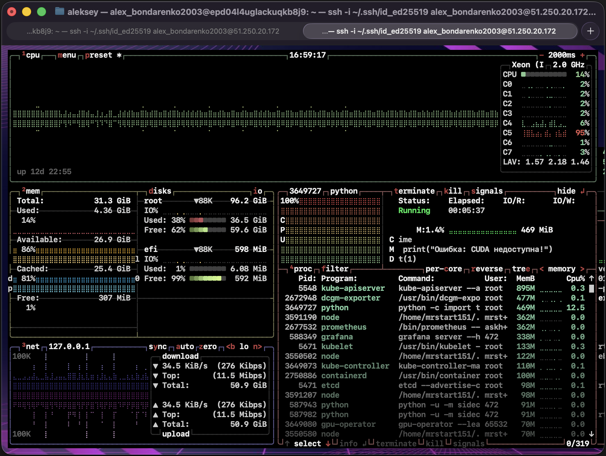

Проброс `Grafana` на сервере
```Bash
kubectl port-forward -n monitoring svc/monitoring-grafana 3000:80
```

Проброс `Grafana` на личном пк
```Bash
ssh -i ~/.ssh/id_ed25519 -L 3000:localhost:3000 alex_bondarenko2003@51.250.20.172
```

Логин от `Grafana` - `admin`
Пароль - через команду
```Bash
kubectl get secret -n monitoring monitoring-grafana -o jsonpath='{.data.admin-password}' | base64 -d && echo
```
Вывод: `z2mHJ1RIIgeALKp8KSyYTFmEUSLqw8aazQaeJ7Uk` 

Логирование в `Grafana` появилось после этих команд
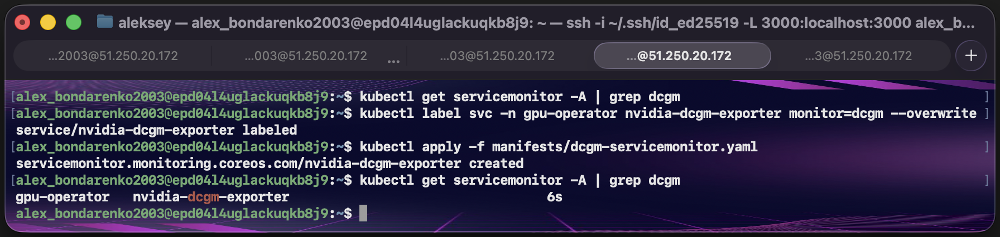

Логирование в `Grafana` 
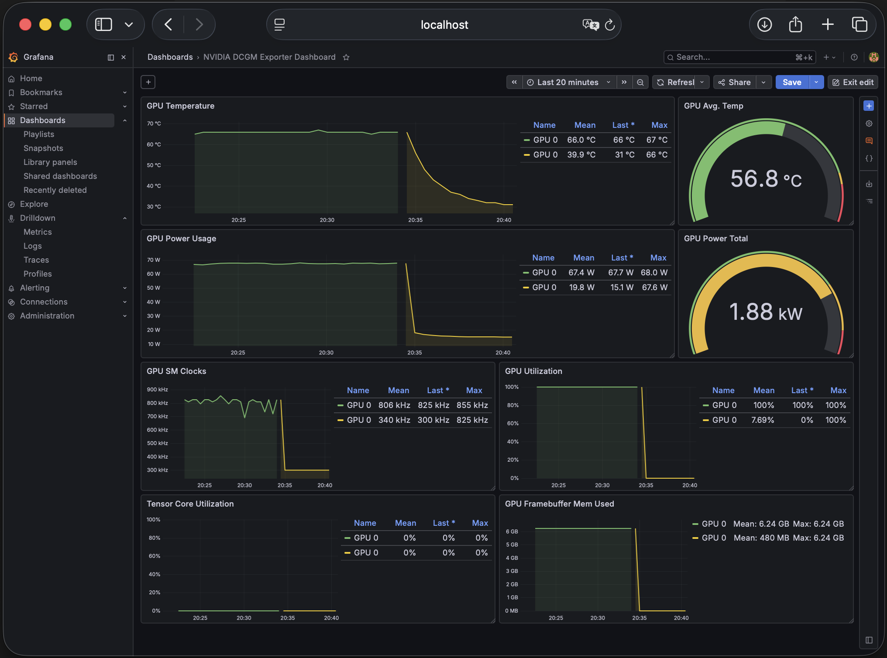

#### Эксперимент 2: Time-slicing

Включаем профиль time-slicing
```Bash
NODE="$(kubectl get nodes -o jsonpath='{.items[0].metadata.name}')"
kubectl label node "$NODE" nvidia.com/device-plugin.config=t4-timeslicing-4 --overwrite
kubectl rollout restart -n gpu-operator daemonset/nvidia-device-plugin-daemonset
```

K8s теперь видит 4 видеокарты:
```Bash
kubectl describe node "$NODE" | sed -n '/Capacity:/,/Allocatable:/p'
```
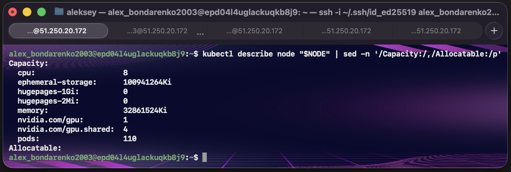

Создаем манифест для параллельных задач
```Bash
cat << 'EOF' > manifests/torch-benchmark-shared.yaml
apiVersion: batch/v1
kind: Job
metadata:
  name: torch-benchmark
  namespace: gpu-lab
spec:
  template:
    spec:
      restartPolicy: Never
      containers:
      - name: benchmark
        image: pytorch/pytorch:2.2.1-cuda12.1-cudnn8-runtime
        env:
        - name: PYTHONUNBUFFERED
          value: "1"
        resources:
          limits:
            # Запрашиваем 1 "долю" GPU
            nvidia.com/gpu.shared: 1
        command:
        - "python"
        - "-c"
        - |
          import torch
          import time
          
          device = torch.device('cuda:0')
          
          # Уменьшенная матрица, чтобы 4 задачи влезли в 15 GB видеопамяти
          N = 12000
          print(f"Генерация матриц {N}x{N}...")
          A = torch.randn(N, N, device=device)
          B = torch.randn(N, N, device=device)
          
          steps = 15
          times = []
          
          print("Прогрев GPU (Warmup)...")
          for _ in range(3):
              _ = torch.matmul(A, B)
          torch.cuda.synchronize()
          
          print(f"\nЗапуск бенчмарка в режиме Time-slicing...")
          for i in range(steps):
              start = time.time()
              
              for _ in range(10):
                  _ = torch.matmul(A, B)
              torch.cuda.synchronize()
              
              end = time.time()
              step_time = end - start
              times.append(step_time)
              print(f"Шаг {i+1:02d}/{steps} выполнен за {step_time:.4f} сек")
          
          print("\n--- Итоговые результаты для отчета ---")
          print(f"avg_step_sec: {sum(times)/len(times):.4f}")
          print(f"peak_cuda_mem_gb: {torch.cuda.max_memory_allocated(device)/1e9:.4f}")
EOF
```

Запуск 4 параллельных задач
```Bash
for i in 1 2 3 4; do
  kubectl delete job -n gpu-lab --ignore-not-found "torch-benchmark-ts-$i"
  sed "s/name: torch-benchmark/name: torch-benchmark-ts-$i/" manifests/torch-benchmark-shared.yaml | kubectl apply -f -
done
```

Следим за запуском подов
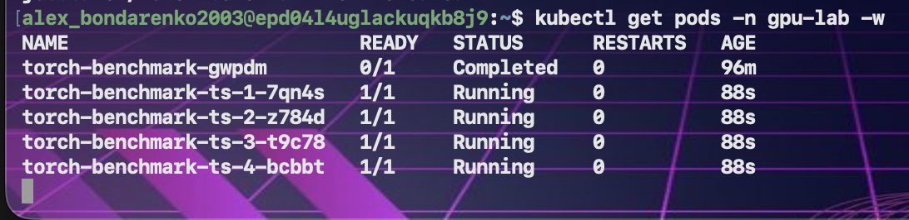

Сбор метрик
```Bash
kubectl logs -n gpu-lab -f job/torch-benchmark-ts-1
```
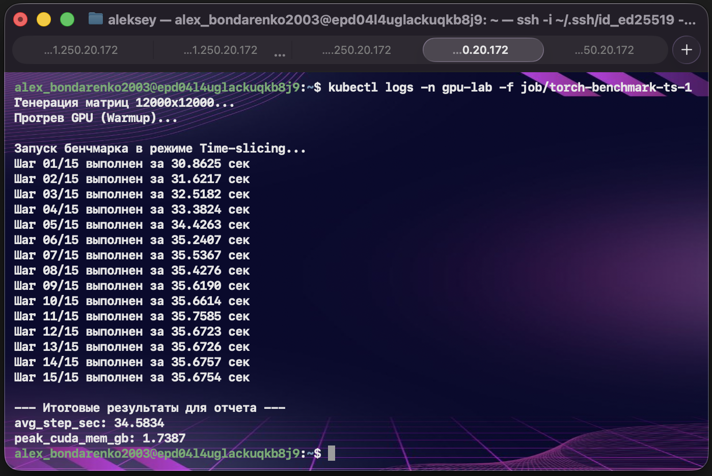

Логирование в `btop`
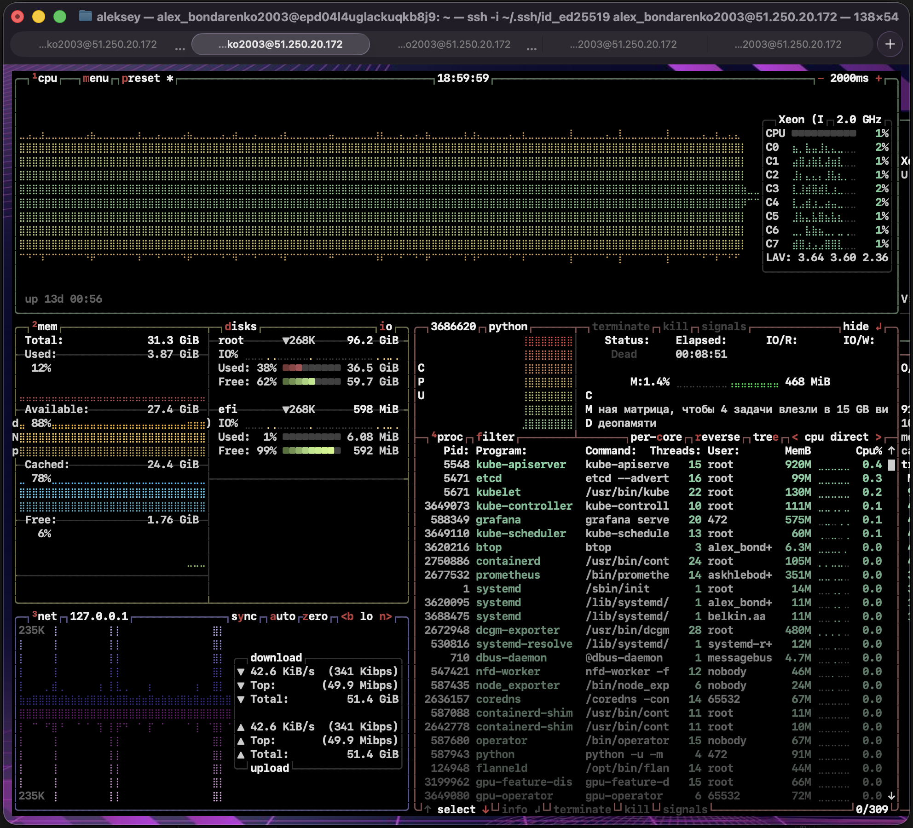

Логирование в `Grafana` снова появилось только после этих команд


Логирование в `Grafana`
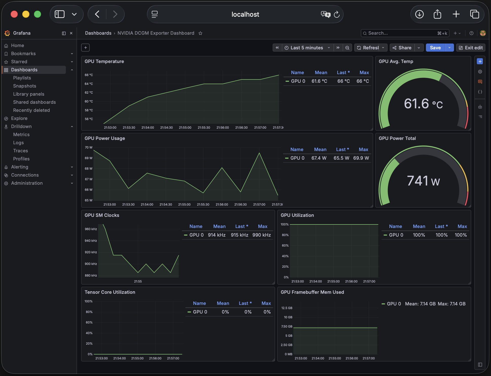

Собираем статистику
```Bash
for i in 1 2 3 4; do
  echo "===== torch-benchmark-ts-$i ====="
  kubectl logs -n gpu-lab "job/torch-benchmark-ts-$i" | tail -n 4
done
```
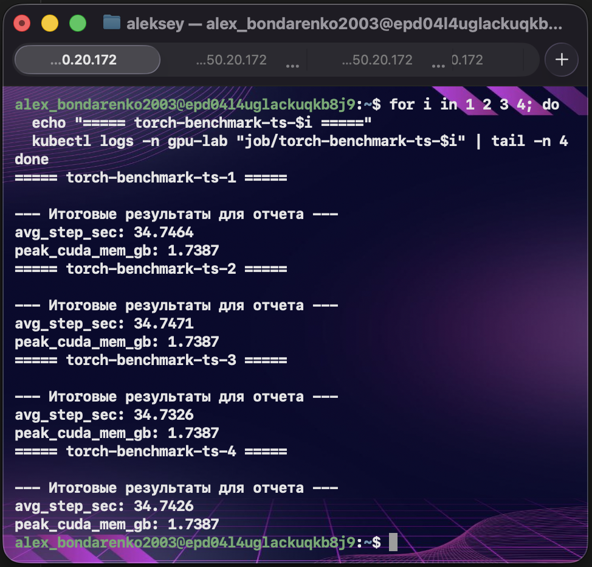

#### Анализ Эксперимента 2 (Time-slicing)
1. **Потребление памяти:** В консоли мы видим, что каждый процесс забрал `1.7387 GB`. Умножаем на 4 процесса = `~6.95 GB`. Смотрим на наш скриншот Grafana - там `7.14 GB`. Разница в `~0.2 GB` - это базовый контекст CUDA. Всё сходится! Изоляции памяти действительно нет, процессы просто делят общую VRAM.
2. **Время выполнения (`avg_step_sec`):** У нас получилось **~34.74 сек** для каждой задачи. 
   Вычислительная сложность умножения матриц падает в кубе ($O(N^3)$). Если бы мы запустили матрицу `12000` в режиме Exclusive, один шаг занял бы всего **~8-9 секунд**. 
   А так как 4 процесса боролись за вычислительные ядра (SM) одной T4, видеокарте приходилось постоянно переключать контекст между ними. Поэтому время растянулось с 9 до 35 секунд для каждой задачи. Это наглядная демонстрация overhead'а (издержек) Time-slicing!

#### Итоговуая таблица:

| Режим | Число pod | Kubernetes resource | Среднее время job | Пик GPU util | Пик FB used | Комментарий |
| :--- | :--- | :--- | :--- | :--- | :--- | :--- |
| **Exclusive** | 1 | `nvidia.com/gpu` | 40.46 сек | 100% | 6.40 GB / 6.24 GB | Максимальная производительность для одной тяжелой задачи (матрица 20000x20000). |
| **Time-slicing** | 4 | `nvidia.com/gpu.shared` | 34.74 сек | 100% | 1.74 GB на pod (Суммарно 7.14 GB) | 4 задачи работали параллельно. Из-за переключения контекста время отдельной задачи выросло (матрица 12000x12000). |

#### Ответы на контрольные вопросы 

* **Почему в exclusive одна job обычно выполняется быстрее?**
  Потому что процесс получает монопольный доступ ко всем вычислительным ядрам (SM) и пропускной способности памяти видеокарты. Нет задержек на переключение контекста между процессами (context switching overhead).
* **Почему в time-slicing можно запустить несколько pod на одной GPU?**
  NVIDIA Device Plugin создает виртуальные ресурсы (в нашем случае 4 штуки `nvidia.com/gpu.shared`), "обманывая" Kubernetes, чтобы планировщик (scheduler) позволил запустить 4 пода на одной ноде. На уровне драйвера задачи отправляются на GPU по очереди квантами времени (round-robin).
* **Какие риски появляются при разделении одной GPU между несколькими pod?**
  1) *Нехватка памяти (OOM):* нет жесткой изоляции видеопамяти. Если один pod решит занять всю память (как наша первая задача на 6.4 ГБ), остальные упадут с ошибкой `CUDA Out of Memory`.
  2) *Шумные соседи:* интенсивная нагрузка в одном контейнере увеличит latency (задержку) для всех остальных.
* **Чем MPS концептуально отличается от обычного time-slicing?**
  Time-slicing разделяет GPU *во времени* (задачи выполняются по очереди с быстрым переключением). MPS (Multi-Process Service) разделяет GPU *пространственно*: ядра (SM) одновременно выполняют инструкции из разных процессов. Это снижает overhead на переключение и повышает утилизацию, но требует поддержки архитектурой карты.
* **Какой режим вы бы выбрали для интерактивного JupyterLab, а какой для batch-задачи?**
  * Для интерактивного JupyterLab (учебного) - **Time-slicing или MPS**, так как большая часть времени уходит на написание кода, а GPU простаивает. Это позволит экономно утилизировать ресурс.
  * Для batch-задачи (тяжелого обучения модели) - **Exclusive**, чтобы получить максимальную скорость, предсказуемое время выполнения и весь объем видеопамяти.

#### Диагностика состояния узла

Общая информация об узле
```Bash
kubectl get nodes -o wide
```
Подробное описание узла
```Bash
NODE="$(kubectl get nodes -o jsonpath='{.items[0].metadata.name}')" kubectl describe node "$NODE"
```
Просмотр меток (labels) узла
```Bash
kubectl get node -o json | jq '.items[0].metadata.labels'
```

Лог
```Bash
**alex_bondarenko2003@epd04l4uglackuqkb8j9**:**~**$ kubectl get nodes -o wide

NAME                   STATUS   ROLES           AGE   VERSION   INTERNAL-IP   EXTERNAL-IP   OS-IMAGE             KERNEL-VERSION       CONTAINER-RUNTIME

epd04l4uglackuqkb8j9   Ready    control-plane   13d   v1.34.8   10.129.0.33   <none>        Ubuntu 22.04.5 LTS   5.15.0-157-generic   containerd://2.2.1

**alex_bondarenko2003@epd04l4uglackuqkb8j9**:**~**$ NODE="$(kubectl get nodes -o jsonpath='{.items[0].metadata.name}')" kubectl describe node "$NODE"

Name:               epd04l4uglackuqkb8j9

Roles:              control-plane

Labels:             beta.kubernetes.io/arch=amd64

                    beta.kubernetes.io/os=linux

                    feature.node.kubernetes.io/cpu-cpuid.ADX=true

                    feature.node.kubernetes.io/cpu-cpuid.AESNI=true

                    feature.node.kubernetes.io/cpu-cpuid.AMXFP8=true

                    feature.node.kubernetes.io/cpu-cpuid.AVX=true

                    feature.node.kubernetes.io/cpu-cpuid.AVX2=true

                    feature.node.kubernetes.io/cpu-cpuid.AVX512BITALG=true

                    feature.node.kubernetes.io/cpu-cpuid.AVX512BW=true

                    feature.node.kubernetes.io/cpu-cpuid.AVX512CD=true

                    feature.node.kubernetes.io/cpu-cpuid.AVX512DQ=true

                    feature.node.kubernetes.io/cpu-cpuid.AVX512F=true

                    feature.node.kubernetes.io/cpu-cpuid.AVX512IFMA=true

                    feature.node.kubernetes.io/cpu-cpuid.AVX512VBMI=true

                    feature.node.kubernetes.io/cpu-cpuid.AVX512VBMI2=true

                    feature.node.kubernetes.io/cpu-cpuid.AVX512VL=true

                    feature.node.kubernetes.io/cpu-cpuid.AVX512VNNI=true

                    feature.node.kubernetes.io/cpu-cpuid.AVX512VPOPCNTDQ=true

                    feature.node.kubernetes.io/cpu-cpuid.CMPXCHG8=true

                    feature.node.kubernetes.io/cpu-cpuid.FMA3=true

                    feature.node.kubernetes.io/cpu-cpuid.FSRM=true

                    feature.node.kubernetes.io/cpu-cpuid.FXSR=true

                    feature.node.kubernetes.io/cpu-cpuid.FXSROPT=true

                    feature.node.kubernetes.io/cpu-cpuid.GFNI=true

                    feature.node.kubernetes.io/cpu-cpuid.HYPERVISOR=true

                    feature.node.kubernetes.io/cpu-cpuid.IA32_ARCH_CAP=true

                    feature.node.kubernetes.io/cpu-cpuid.IBPB=true

                    feature.node.kubernetes.io/cpu-cpuid.LAHF=true

                    feature.node.kubernetes.io/cpu-cpuid.MD_CLEAR=true

                    feature.node.kubernetes.io/cpu-cpuid.MOVBE=true

                    feature.node.kubernetes.io/cpu-cpuid.OSXSAVE=true

                    feature.node.kubernetes.io/cpu-cpuid.SHA=true

                    feature.node.kubernetes.io/cpu-cpuid.SPEC_CTRL_SSBD=true

                    feature.node.kubernetes.io/cpu-cpuid.STIBP=true

                    feature.node.kubernetes.io/cpu-cpuid.SYSCALL=true

                    feature.node.kubernetes.io/cpu-cpuid.SYSEE=true

                    feature.node.kubernetes.io/cpu-cpuid.VAES=true

                    feature.node.kubernetes.io/cpu-cpuid.VPCLMULQDQ=true

                    feature.node.kubernetes.io/cpu-cpuid.WBNOINVD=true

                    feature.node.kubernetes.io/cpu-cpuid.X87=true

                    feature.node.kubernetes.io/cpu-cpuid.XGETBV1=true

                    feature.node.kubernetes.io/cpu-cpuid.XSAVE=true

                    feature.node.kubernetes.io/cpu-cpuid.XSAVEC=true

                    feature.node.kubernetes.io/cpu-cpuid.XSAVEOPT=true

                    feature.node.kubernetes.io/cpu-hardware_multithreading=true

                    feature.node.kubernetes.io/cpu-model.family=6

                    feature.node.kubernetes.io/cpu-model.id=106

                    feature.node.kubernetes.io/cpu-model.vendor_id=Intel

                    feature.node.kubernetes.io/kernel-config.NO_HZ=true

                    feature.node.kubernetes.io/kernel-config.NO_HZ_IDLE=true

                    feature.node.kubernetes.io/kernel-version.full=5.15.0-157-generic

                    feature.node.kubernetes.io/kernel-version.major=5

                    feature.node.kubernetes.io/kernel-version.minor=15

                    feature.node.kubernetes.io/kernel-version.revision=0

                    feature.node.kubernetes.io/pci-10de.present=true

                    feature.node.kubernetes.io/pci-1234.present=true

                    feature.node.kubernetes.io/pci-1af4.present=true

                    feature.node.kubernetes.io/system-os_release.ID=ubuntu

                    feature.node.kubernetes.io/system-os_release.VERSION_ID=22.04

                    feature.node.kubernetes.io/system-os_release.VERSION_ID.major=22

                    feature.node.kubernetes.io/system-os_release.VERSION_ID.minor=04

                    kubernetes.io/arch=amd64

                    kubernetes.io/hostname=epd04l4uglackuqkb8j9

                    kubernetes.io/os=linux

                    node-role.kubernetes.io/control-plane=

                    node.kubernetes.io/exclude-from-external-load-balancers=

                    nvidia.com/cuda.driver-version.full=580.105.08

                    nvidia.com/cuda.driver-version.major=580

                    nvidia.com/cuda.driver-version.minor=105

                    nvidia.com/cuda.driver-version.revision=08

                    nvidia.com/cuda.driver.major=580

                    nvidia.com/cuda.driver.minor=105

                    nvidia.com/cuda.driver.rev=08

                    nvidia.com/cuda.runtime-version.full=13.0

                    nvidia.com/cuda.runtime-version.major=13

                    nvidia.com/cuda.runtime-version.minor=0

                    nvidia.com/cuda.runtime.major=13

                    nvidia.com/cuda.runtime.minor=0

                    nvidia.com/device-plugin.config=t4-timeslicing-4

                    nvidia.com/dra-kubelet-plugin=true

                    nvidia.com/gfd.timestamp=1780251233

                    nvidia.com/gpu-driver-upgrade-state=upgrade-done

                    nvidia.com/gpu.compute.major=7

                    nvidia.com/gpu.compute.minor=5

                    nvidia.com/gpu.count=1

                    nvidia.com/gpu.deploy.container-toolkit=true

                    nvidia.com/gpu.deploy.dcgm=true

                    nvidia.com/gpu.deploy.dcgm-exporter=true

                    nvidia.com/gpu.deploy.device-plugin=true

                    nvidia.com/gpu.deploy.driver=true

                    nvidia.com/gpu.deploy.gpu-feature-discovery=true

                    nvidia.com/gpu.deploy.node-status-exporter=true

                    nvidia.com/gpu.deploy.nvsm=

                    nvidia.com/gpu.deploy.operator-validator=true

                    nvidia.com/gpu.family=turing

                    nvidia.com/gpu.machine=xeon-gold-6338

                    nvidia.com/gpu.memory=15360

                    nvidia.com/gpu.mode=compute

                    nvidia.com/gpu.present=true

                    nvidia.com/gpu.product=Tesla-T4

                    nvidia.com/gpu.replicas=4

                    nvidia.com/gpu.sharing-strategy=time-slicing

                    nvidia.com/mig.capable=false

                    nvidia.com/mig.strategy=single

                    nvidia.com/mps.capable=false

                    nvidia.com/vgpu.present=false

Annotations:        flannel.alpha.coreos.com/backend-data: {"VNI":1,"VtepMAC":"fe:f4:3f:f5:6f:1a"}

                    flannel.alpha.coreos.com/backend-type: vxlan

                    flannel.alpha.coreos.com/kube-subnet-manager: true

                    flannel.alpha.coreos.com/public-ip: 10.129.0.33

                    nfd.node.kubernetes.io/feature-labels:

                      cpu-cpuid.ADX,cpu-cpuid.AESNI,cpu-cpuid.AMXFP8,cpu-cpuid.AVX,cpu-cpuid.AVX2,cpu-cpuid.AVX512BITALG,cpu-cpuid.AVX512BW,cpu-cpuid.AVX512CD,c...

                    node.alpha.kubernetes.io/ttl: 0

                    nvidia.com/gpu-driver-upgrade-enabled: true

                    volumes.kubernetes.io/controller-managed-attach-detach: true

CreationTimestamp:  Mon, 18 May 2026 18:09:35 +0000

Taints:             <none>

Unschedulable:      false

Lease:

  HolderIdentity:  epd04l4uglackuqkb8j9

  AcquireTime:     <unset>

  RenewTime:       Sun, 31 May 2026 19:27:30 +0000

Conditions:

  Type                 Status  LastHeartbeatTime                 LastTransitionTime                Reason                       Message

  ----                 ------  -----------------                 ------------------                ------                       -------

  NetworkUnavailable   False   Sat, 23 May 2026 17:00:37 +0000   Sat, 23 May 2026 17:00:37 +0000   FlannelIsUp                  Flannel is running on this node

  MemoryPressure       False   Sun, 31 May 2026 19:26:22 +0000   Mon, 18 May 2026 18:09:34 +0000   KubeletHasSufficientMemory   kubelet has sufficient memory available

  DiskPressure         False   Sun, 31 May 2026 19:26:22 +0000   Mon, 18 May 2026 18:09:34 +0000   KubeletHasNoDiskPressure     kubelet has no disk pressure

  PIDPressure          False   Sun, 31 May 2026 19:26:22 +0000   Mon, 18 May 2026 18:09:34 +0000   KubeletHasSufficientPID      kubelet has sufficient PID available

  Ready                True    Sun, 31 May 2026 19:26:22 +0000   Sat, 23 May 2026 17:00:46 +0000   KubeletReady                 kubelet is posting ready status

Addresses:

  InternalIP:  10.129.0.33

  Hostname:    epd04l4uglackuqkb8j9

Capacity:

  cpu:                    8

  ephemeral-storage:      100941264Ki

  hugepages-1Gi:          0

  hugepages-2Mi:          0

  memory:                 32861524Ki

  nvidia.com/gpu:         0

  nvidia.com/gpu.shared:  4

  pods:                   110

Allocatable:

  cpu:                    8

  ephemeral-storage:      93027468749

  hugepages-1Gi:          0

  hugepages-2Mi:          0

  memory:                 32759124Ki

  nvidia.com/gpu:         0

  nvidia.com/gpu.shared:  4

  pods:                   110

System Info:

  Machine ID:                 2300000765a02549e8554ca7b545a269

  System UUID:                23000007-65a0-2549-e855-4ca7b545a269

  Boot ID:                    2c3d3404-c3cb-4fcf-aba6-7240b4cd0c76

  Kernel Version:             5.15.0-157-generic

  OS Image:                   Ubuntu 22.04.5 LTS

  Operating System:           linux

  Architecture:               amd64

  Container Runtime Version:  containerd://2.2.1

  Kubelet Version:            v1.34.8

  Kube-Proxy Version:         

PodCIDR:                      10.244.0.0/24

PodCIDRs:                     10.244.0.0/24

Non-terminated Pods:          (24 in total)

  Namespace                   Name                                                           CPU Requests  CPU Limits  Memory Requests  Memory Limits  Age

  ---------                   ----                                                           ------------  ----------  ---------------  -------------  ---

  gpu-operator                gpu-feature-discovery-4qtmf                                    0 (0%)        0 (0%)      0 (0%)           0 (0%)         23h

  gpu-operator                gpu-operator-7569f8b499-q89zq                                  200m (2%)     500m (6%)   100Mi (0%)       350Mi (1%)     7d4h

  gpu-operator                gpu-operator-node-feature-discovery-gc-55ffc49ccc-m8qwf        10m (0%)      0 (0%)      128Mi (0%)       1Gi (3%)       7d4h

  gpu-operator                gpu-operator-node-feature-discovery-master-6b5787f695-nljvs    100m (1%)     0 (0%)      128Mi (0%)       4Gi (12%)      7d4h

  gpu-operator                gpu-operator-node-feature-discovery-worker-7pkkc               5m (0%)       0 (0%)      64Mi (0%)        512Mi (1%)     7d4h

  gpu-operator                nvidia-container-toolkit-daemonset-8zm7n                       0 (0%)        0 (0%)      0 (0%)           0 (0%)         45h

  gpu-operator                nvidia-dcgm-exporter-s4swb                                     0 (0%)        0 (0%)      0 (0%)           0 (0%)         46h

  gpu-operator                nvidia-device-plugin-daemonset-828tp                           0 (0%)        0 (0%)      0 (0%)           0 (0%)         73m

  gpu-operator                nvidia-driver-daemonset-2xv6p                                  0 (0%)        0 (0%)      0 (0%)           0 (0%)         46h

  gpu-operator                nvidia-operator-validator-s922x                                0 (0%)        0 (0%)      0 (0%)           0 (0%)         45h

  kube-flannel                kube-flannel-ds-mqdrp                                          100m (1%)     0 (0%)      50Mi (0%)        0 (0%)         8d

  kube-system                 coredns-59486948-4hr6q                                         100m (1%)     0 (0%)      70Mi (0%)        170Mi (0%)     46h

  kube-system                 coredns-59486948-d9897                                         100m (1%)     0 (0%)      70Mi (0%)        170Mi (0%)     46h

  kube-system                 etcd-epd04l4uglackuqkb8j9                                      100m (1%)     0 (0%)      100Mi (0%)       0 (0%)         13d

  kube-system                 kube-apiserver-epd04l4uglackuqkb8j9                            250m (3%)     0 (0%)      0 (0%)           0 (0%)         13d

  kube-system                 kube-controller-manager-epd04l4uglackuqkb8j9                   200m (2%)     0 (0%)      0 (0%)           0 (0%)         13d

  kube-system                 kube-proxy-w2zcq                                               0 (0%)        0 (0%)      0 (0%)           0 (0%)         46h

  kube-system                 kube-scheduler-epd04l4uglackuqkb8j9                            100m (1%)     0 (0%)      0 (0%)           0 (0%)         13d

  monitoring                  alertmanager-monitoring-kube-prometheus-alertmanager-0         0 (0%)        0 (0%)      200Mi (0%)       0 (0%)         7d4h

  monitoring                  monitoring-grafana-655fdb87f5-jhtk8                            0 (0%)        0 (0%)      0 (0%)           0 (0%)         7d4h

  monitoring                  monitoring-kube-prometheus-operator-7b677cd9bf-7zqfk           0 (0%)        0 (0%)      0 (0%)           0 (0%)         7d4h

  monitoring                  monitoring-kube-state-metrics-7f7f8474d9-77hfs                 0 (0%)        0 (0%)      0 (0%)           0 (0%)         7d4h

  monitoring                  monitoring-prometheus-node-exporter-5rz6v                      0 (0%)        0 (0%)      0 (0%)           0 (0%)         7d4h

  monitoring                  prometheus-monitoring-kube-prometheus-prometheus-0             0 (0%)        0 (0%)      0 (0%)           0 (0%)         46h

Allocated resources:

  (Total limits may be over 100 percent, i.e., overcommitted.)

  Resource               Requests     Limits

  --------               --------     ------

  cpu                    1265m (15%)  500m (6%)

  memory                 910Mi (2%)   6322Mi (19%)

  ephemeral-storage      0 (0%)       0 (0%)

  hugepages-1Gi          0 (0%)       0 (0%)

  hugepages-2Mi          0 (0%)       0 (0%)

  nvidia.com/gpu         0            0

  nvidia.com/gpu.shared  0            0

Events:                  <none>

**alex_bondarenko2003@epd04l4uglackuqkb8j9**:**~**$ kubectl get node -o json | jq '.items[0].metadata.labels'

**{**

  **"beta.kubernetes.io/arch"****:** "amd64"**,**

  **"beta.kubernetes.io/os"****:** "linux"**,**

  **"feature.node.kubernetes.io/cpu-cpuid.ADX"****:** "true"**,**

  **"feature.node.kubernetes.io/cpu-cpuid.AESNI"****:** "true"**,**

  **"feature.node.kubernetes.io/cpu-cpuid.AMXFP8"****:** "true"**,**

  **"feature.node.kubernetes.io/cpu-cpuid.AVX"****:** "true"**,**

  **"feature.node.kubernetes.io/cpu-cpuid.AVX2"****:** "true"**,**

  **"feature.node.kubernetes.io/cpu-cpuid.AVX512BITALG"****:** "true"**,**

  **"feature.node.kubernetes.io/cpu-cpuid.AVX512BW"****:** "true"**,**

  **"feature.node.kubernetes.io/cpu-cpuid.AVX512CD"****:** "true"**,**

  **"feature.node.kubernetes.io/cpu-cpuid.AVX512DQ"****:** "true"**,**

  **"feature.node.kubernetes.io/cpu-cpuid.AVX512F"****:** "true"**,**

  **"feature.node.kubernetes.io/cpu-cpuid.AVX512IFMA"****:** "true"**,**

  **"feature.node.kubernetes.io/cpu-cpuid.AVX512VBMI"****:** "true"**,**

  **"feature.node.kubernetes.io/cpu-cpuid.AVX512VBMI2"****:** "true"**,**

  **"feature.node.kubernetes.io/cpu-cpuid.AVX512VL"****:** "true"**,**

  **"feature.node.kubernetes.io/cpu-cpuid.AVX512VNNI"****:** "true"**,**

  **"feature.node.kubernetes.io/cpu-cpuid.AVX512VPOPCNTDQ"****:** "true"**,**

  **"feature.node.kubernetes.io/cpu-cpuid.CMPXCHG8"****:** "true"**,**

  **"feature.node.kubernetes.io/cpu-cpuid.FMA3"****:** "true"**,**

  **"feature.node.kubernetes.io/cpu-cpuid.FSRM"****:** "true"**,**

  **"feature.node.kubernetes.io/cpu-cpuid.FXSR"****:** "true"**,**

  **"feature.node.kubernetes.io/cpu-cpuid.FXSROPT"****:** "true"**,**

  **"feature.node.kubernetes.io/cpu-cpuid.GFNI"****:** "true"**,**

  **"feature.node.kubernetes.io/cpu-cpuid.HYPERVISOR"****:** "true"**,**

  **"feature.node.kubernetes.io/cpu-cpuid.IA32_ARCH_CAP"****:** "true"**,**

  **"feature.node.kubernetes.io/cpu-cpuid.IBPB"****:** "true"**,**

  **"feature.node.kubernetes.io/cpu-cpuid.LAHF"****:** "true"**,**

  **"feature.node.kubernetes.io/cpu-cpuid.MD_CLEAR"****:** "true"**,**

  **"feature.node.kubernetes.io/cpu-cpuid.MOVBE"****:** "true"**,**

  **"feature.node.kubernetes.io/cpu-cpuid.OSXSAVE"****:** "true"**,**

  **"feature.node.kubernetes.io/cpu-cpuid.SHA"****:** "true"**,**

  **"feature.node.kubernetes.io/cpu-cpuid.SPEC_CTRL_SSBD"****:** "true"**,**

  **"feature.node.kubernetes.io/cpu-cpuid.STIBP"****:** "true"**,**

  **"feature.node.kubernetes.io/cpu-cpuid.SYSCALL"****:** "true"**,**

  **"feature.node.kubernetes.io/cpu-cpuid.SYSEE"****:** "true"**,**

  **"feature.node.kubernetes.io/cpu-cpuid.VAES"****:** "true"**,**

  **"feature.node.kubernetes.io/cpu-cpuid.VPCLMULQDQ"****:** "true"**,**

  **"feature.node.kubernetes.io/cpu-cpuid.WBNOINVD"****:** "true"**,**

  **"feature.node.kubernetes.io/cpu-cpuid.X87"****:** "true"**,**

  **"feature.node.kubernetes.io/cpu-cpuid.XGETBV1"****:** "true"**,**

  **"feature.node.kubernetes.io/cpu-cpuid.XSAVE"****:** "true"**,**

  **"feature.node.kubernetes.io/cpu-cpuid.XSAVEC"****:** "true"**,**

  **"feature.node.kubernetes.io/cpu-cpuid.XSAVEOPT"****:** "true"**,**

  **"feature.node.kubernetes.io/cpu-hardware_multithreading"****:** "true"**,**

  **"feature.node.kubernetes.io/cpu-model.family"****:** "6"**,**

  **"feature.node.kubernetes.io/cpu-model.id"****:** "106"**,**

  **"feature.node.kubernetes.io/cpu-model.vendor_id"****:** "Intel"**,**

  **"feature.node.kubernetes.io/kernel-config.NO_HZ"****:** "true"**,**

  **"feature.node.kubernetes.io/kernel-config.NO_HZ_IDLE"****:** "true"**,**

  **"feature.node.kubernetes.io/kernel-version.full"****:** "5.15.0-157-generic"**,**

  **"feature.node.kubernetes.io/kernel-version.major"****:** "5"**,**

  **"feature.node.kubernetes.io/kernel-version.minor"****:** "15"**,**

  **"feature.node.kubernetes.io/kernel-version.revision"****:** "0"**,**

  **"feature.node.kubernetes.io/pci-10de.present"****:** "true"**,**

  **"feature.node.kubernetes.io/pci-1234.present"****:** "true"**,**

  **"feature.node.kubernetes.io/pci-1af4.present"****:** "true"**,**

  **"feature.node.kubernetes.io/system-os_release.ID"****:** "ubuntu"**,**

  **"feature.node.kubernetes.io/system-os_release.VERSION_ID"****:** "22.04"**,**

  **"feature.node.kubernetes.io/system-os_release.VERSION_ID.major"****:** "22"**,**

  **"feature.node.kubernetes.io/system-os_release.VERSION_ID.minor"****:** "04"**,**

  **"kubernetes.io/arch"****:** "amd64"**,**

  **"kubernetes.io/hostname"****:** "epd04l4uglackuqkb8j9"**,**

  **"kubernetes.io/os"****:** "linux"**,**

  **"node-role.kubernetes.io/control-plane"****:** ""**,**

  **"node.kubernetes.io/exclude-from-external-load-balancers"****:** ""**,**

  **"nvidia.com/cuda.driver-version.full"****:** "580.105.08"**,**

  **"nvidia.com/cuda.driver-version.major"****:** "580"**,**

  **"nvidia.com/cuda.driver-version.minor"****:** "105"**,**

  **"nvidia.com/cuda.driver-version.revision"****:** "08"**,**

  **"nvidia.com/cuda.driver.major"****:** "580"**,**

  **"nvidia.com/cuda.driver.minor"****:** "105"**,**

  **"nvidia.com/cuda.driver.rev"****:** "08"**,**

  **"nvidia.com/cuda.runtime-version.full"****:** "13.0"**,**

  **"nvidia.com/cuda.runtime-version.major"****:** "13"**,**

  **"nvidia.com/cuda.runtime-version.minor"****:** "0"**,**

  **"nvidia.com/cuda.runtime.major"****:** "13"**,**

  **"nvidia.com/cuda.runtime.minor"****:** "0"**,**

  **"nvidia.com/device-plugin.config"****:** "t4-timeslicing-4"**,**

  **"nvidia.com/dra-kubelet-plugin"****:** "true"**,**

  **"nvidia.com/gfd.timestamp"****:** "1780251233"**,**

  **"nvidia.com/gpu-driver-upgrade-state"****:** "upgrade-done"**,**

  **"nvidia.com/gpu.compute.major"****:** "7"**,**

  **"nvidia.com/gpu.compute.minor"****:** "5"**,**

  **"nvidia.com/gpu.count"****:** "1"**,**

  **"nvidia.com/gpu.deploy.container-toolkit"****:** "true"**,**

  **"nvidia.com/gpu.deploy.dcgm"****:** "true"**,**

  **"nvidia.com/gpu.deploy.dcgm-exporter"****:** "true"**,**

  **"nvidia.com/gpu.deploy.device-plugin"****:** "true"**,**

  **"nvidia.com/gpu.deploy.driver"****:** "true"**,**

  **"nvidia.com/gpu.deploy.gpu-feature-discovery"****:** "true"**,**

  **"nvidia.com/gpu.deploy.node-status-exporter"****:** "true"**,**

  **"nvidia.com/gpu.deploy.nvsm"****:** ""**,**

  **"nvidia.com/gpu.deploy.operator-validator"****:** "true"**,**

  **"nvidia.com/gpu.family"****:** "turing"**,**

  **"nvidia.com/gpu.machine"****:** "xeon-gold-6338"**,**

  **"nvidia.com/gpu.memory"****:** "15360"**,**

  **"nvidia.com/gpu.mode"****:** "compute"**,**

  **"nvidia.com/gpu.present"****:** "true"**,**

  **"nvidia.com/gpu.product"****:** "Tesla-T4"**,**

  **"nvidia.com/gpu.replicas"****:** "4"**,**

  **"nvidia.com/gpu.sharing-strategy"****:** "time-slicing"**,**

  **"nvidia.com/mig.capable"****:** "false"**,**

  **"nvidia.com/mig.strategy"****:** "single"**,**

  **"nvidia.com/mps.capable"****:** "false"**,**

  **"nvidia.com/vgpu.present"****:** "false"

**}**
```

#### Диагностика GPU Operator

Статус подов оператора
```Bash
kubectl get pods -n gpu-operator
```
Статус DaemonSet'ов
```Bash
kubectl get ds -n gpu-operator
```
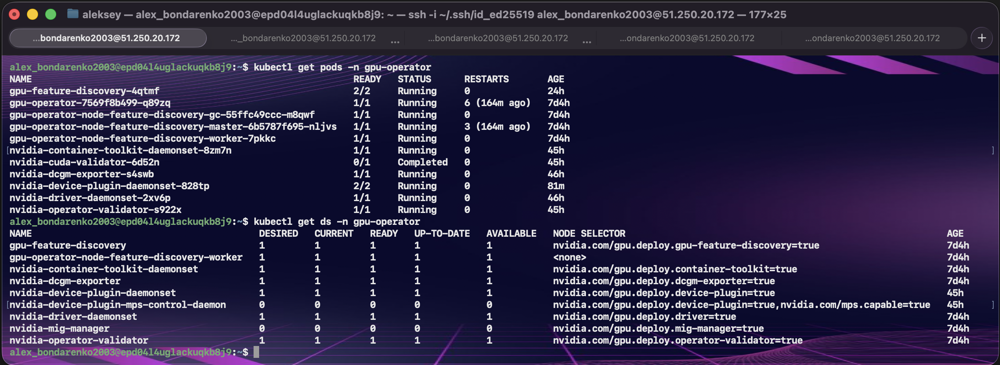

логи основных демонов
```Bash
kubectl logs -n gpu-operator -l app=nvidia-device-plugin-daemonset --tail=50
kubectl logs -n gpu-operator -l app=nvidia-driver-daemonset --tail=50
```

```Bash
**alex_bondarenko2003@epd04l4uglackuqkb8j9**:**~**$ kubectl logs -n gpu-operator -l app=nvidia-device-plugin-daemonset --tail=50

kubectl logs -n gpu-operator -l app=nvidia-driver-daemonset --tail=50

Defaulted container "nvidia-device-plugin" out of: nvidia-device-plugin, config-manager, toolkit-validation (init), config-manager-init (init)

    "gdrcopyEnabled": false,

    "gdsEnabled": false,

    "mofedEnabled": false,

    "useNodeFeatureAPI": null,

    "deviceDiscoveryStrategy": "auto",

    "plugin": {

      "passDeviceSpecs": true,

      "deviceListStrategy": [

        "envvar"

      ],

      "deviceIDStrategy": "uuid",

      "cdiAnnotationPrefix": "cdi.k8s.io/",

      "nvidiaCTKPath": "/usr/bin/nvidia-ctk",

      "containerDriverRoot": "/driver-root"

    }

  },

  "resources": {

    "gpus": [

      {

        "pattern": "*",

        "name": "nvidia.com/gpu"

      }

    ],

    "mig": [

      {

        "pattern": "*",

        "name": "nvidia.com/gpu"

      }

    ]

  },

  "sharing": {

    "timeSlicing": {

      "renameByDefault": true,

      "resources": [

        {

          "name": "nvidia.com/gpu",

          "rename": "nvidia.com/gpu.shared",

          "devices": "all",

          "replicas": 4

        }

      ]

    }

  },

  "imex": {}

}

I0531 18:14:25.249964      71 main.go:366] Retrieving plugins.

I0531 18:14:25.283459      71 server.go:197] Starting GRPC server for 'nvidia.com/gpu.shared'

I0531 18:14:25.284247      71 server.go:141] Starting to serve 'nvidia.com/gpu.shared' on /var/lib/kubelet/device-plugins/nvidia-gpu.shared.sock

I0531 18:14:25.286708      71 server.go:148] Registered device plugin for 'nvidia.com/gpu.shared' with Kubelet

I0531 18:14:25.288684      71 health.go:64] Ignoring the following XIDs for health checks: map[13:true 31:true 43:true 45:true 68:true 109:true]

Unable to locate any tools for listing initramfs contents.

Unable to scan initramfs: no tool found

Installing NVIDIA driver version 580.105.08.

Performing CC sanity check with CC="/usr/bin/cc".

Performing CC check.

Kernel source path: '/lib/modules/5.15.0-157-generic/build'

  

Kernel output path: '/lib/modules/5.15.0-157-generic/build'

  

Performing Compiler check.

Performing Dom0 check.

Performing Xen check.

Performing PREEMPT_RT check.

Performing vgpu_kvm check.

Cleaning kernel module build directory.

Building kernel modules: 

  

  [##############################] 100%

Kernel module compilation complete.

Unable to determine if Secure Boot is enabled: No such file or directory

Installing 'NVIDIA Accelerated Graphics Driver for Linux-x86_64' (580.105.08):: Installing

  

  [                              ]   0%

Unable to determine whether NVIDIA kernel modules are present in the initramfs. Existing NVIDIA kernel modules in the initramfs, if any, may interfere with the newly installed driver.

  

  [##############################] 100%

Driver file installation is complete.

Running post-install sanity check:: Checking

  

  [##############################] 100%

Post-install sanity check passed.

  

Installation of the kernel module for the NVIDIA Accelerated Graphics Driver for Linux-x86_64 (version: 580.105.08) is now complete.

  

Parsing kernel module parameters...

Configuring the following firmware search path in '/sys/module/firmware_class/parameters/path': /run/nvidia/driver/lib/firmware

WARNING: A search path is already configured in /sys/module/firmware_class/parameters/path

         Retaining the current configuration

Loading ipmi and i2c_core kernel modules...

Loading NVIDIA driver kernel modules...

+ modprobe nvidia NVreg_CoherentGPUMemoryMode=driver

+ modprobe nvidia-uvm

+ modprobe nvidia-modeset

+ set +o xtrace -o nounset

Starting NVIDIA persistence daemon...

Mounting NVIDIA driver rootfs...

Done, now waiting for signal
```


#### Очистка кластера

Удаляем все Job'ы из неймспейса:
```Bash
kubectl delete jobs -n gpu-lab --all
```
Полностью удаляем учебный неймспейс
```Bash
kubectl delete namespace gpu-lab
```
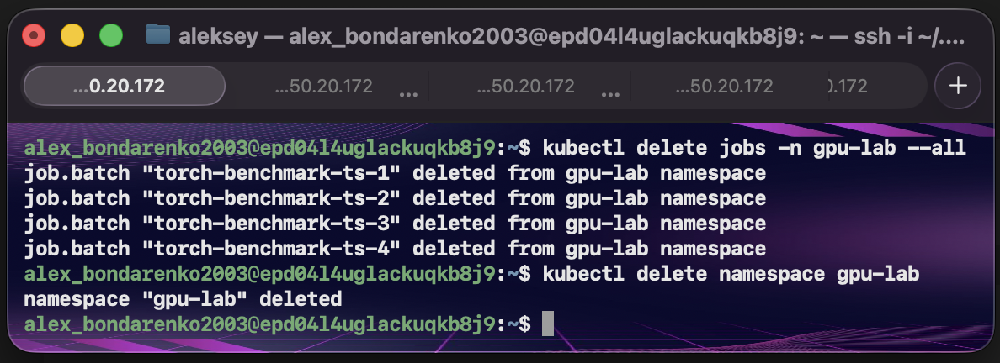
